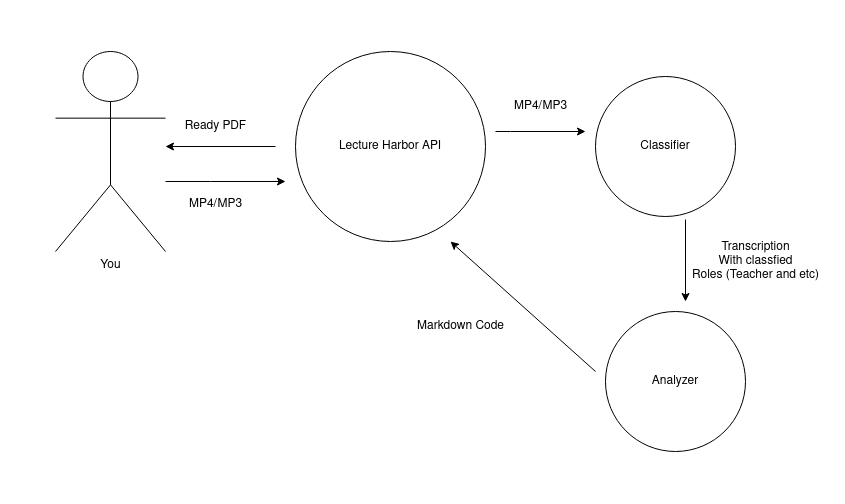

<h1>📚Lecture Harbor API</h1>

 
Have you ever faced with the problem of constructing your notes during the lecture?
If yes, we are ready to announce our open source solution. The main idea of the project
is <b>AI based</b> tool that will give ability to automatically create notes for the given
video\audio lectures.

___
## Concept of the Service

    

The main idea for now lies in implementing 3 main services:
* **LectureHarborAPI** - Main service (layer with auth etc.)
* **Classifier** - AI based layer for getting full transcription of the concept of the MP3 or MP4.
* **Analyzer** - AI based layer for getting main concepts from the given transcription and generating (maybe we will 
decompose it into several layers in the future)
___
## Technical stack
### LectureHarborAPI
For the main service we have chosen **Golang** as a primary programming language for its efficiency and wide popularity.
Later we will update full descriptions of the tools used.
### Classifier 
For working with AI part we have chosen **Python**. Later we will add libraries\frameworks used in the project.
### Analyzer
This part of our AI model will be also based on **Python**. Later we will add libraries\frameworks used in.

___
## License
We are working under MIT License
___
## Contribution
We would be glad to see you in our project. We are looking for:
* Any experienced Golang Developers
* Experienced Python developers in AI sphere. Native language processing, Machine Learning specialists and others.
### Rules of contributing 
As any project we appreciate caution. For any changes firstly you should create an issue with the appropriate tag or 
find something in the *issues* page. After assigning work to, you can start by forking the repo and making PR in the 
end. After that you can write to the owner of the repository by GitHub or Email and then wait for the work being proven.
Hope that such a work will be good idea. Good luck and let's make life easier!